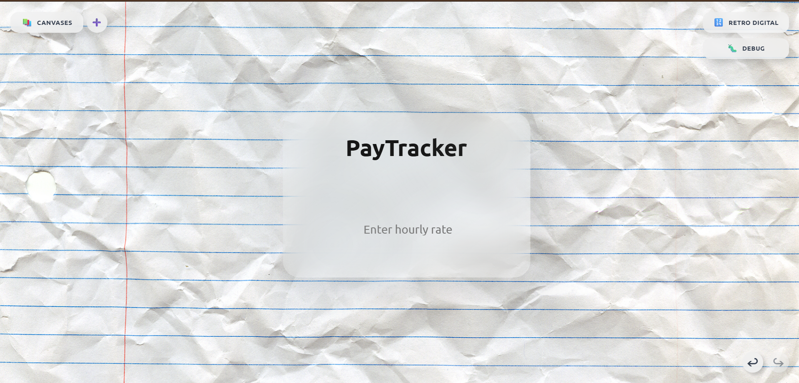
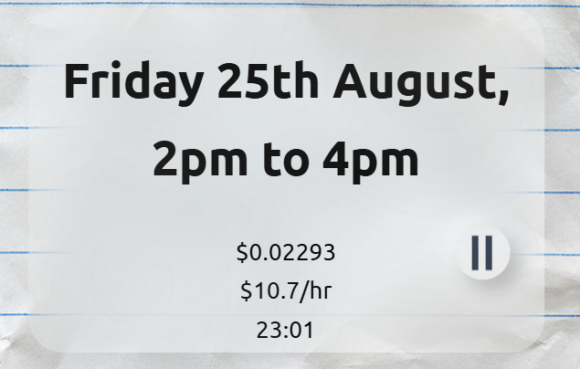
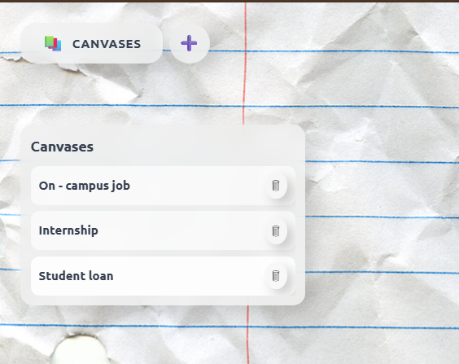
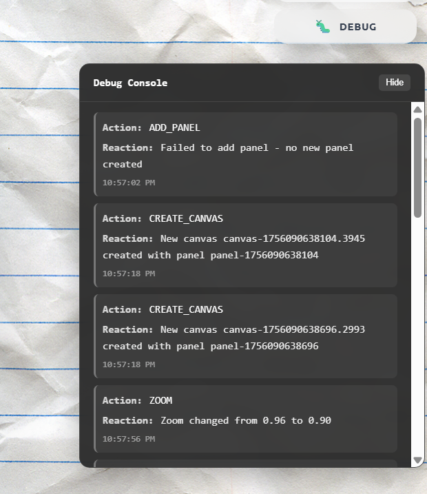
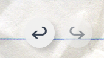
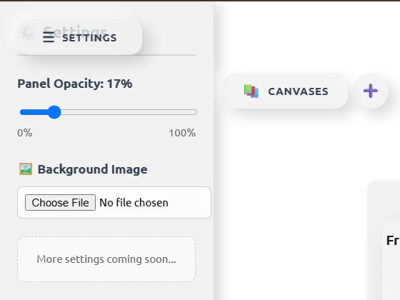
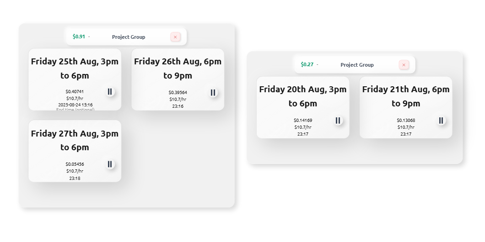

# Pay Check - Time Tracking & Earnings Calculator

A modern, elegant time-tracking application built with React and Vite. Track your work hours and calculate earnings in real-time with a beautiful, seamless interface featuring glassmorphism effects and intuitive controls.

## 🌐 Live Demo

**[🚀 Try Pay Check Live](https://pay-check-lilac.vercel.app/)** - Access the application 24/7 on Vercel

## 📁 Project Structure

```
Pay_Check-Cursor/
├── 📁 src/                    # Source code
│   ├── components/            # React components
│   ├── hooks/                 # Custom React hooks
│   ├── utils/                 # Utility functions
│   ├── App.jsx                # Main application
│   ├── main.jsx               # Entry point
│   └── index.css              # Global styles
├── 📁 assets/                 # Static assets
│   ├── images/                # Images and backgrounds
│   └── icons/                 # Icon files
├── 📁 docs/                   # Documentation
│   ├── README.md              # Detailed project documentation
│   ├── OPTIMIZATION_SUMMARY.md # Performance optimizations
│   ├── progress.txt           # Development progress
│   └── todo.md                # Development tasks
├── 📁 build/                  # Build outputs
│   ├── dist/                  # Production build
│   └── node_modules/          # Dependencies
├── 📁 public/                 # Public assets
├── package.json               # Project configuration
├── vite.config.js             # Vite configuration
└── tailwind.config.js         # Tailwind CSS configuration
```

## 🖼️ Screenshots

### Homepage


*Clean, modern interface with glassmorphism effects*


### Main Panel


*Central control panel with earnings display and timer controls*


### Canvas System


*Multiple canvas layers for rich visual experience*


### Debug Window


*Real-time debugging and state monitoring*


### Undo/Redo Controls


*History navigation controls*


### Settings Panel


*Application settings and configuration options*


### Grouping Interface


*Advanced grouping and organization features*


## 🚀 Quick Start

1. **Install dependencies:**
   ```bash
   npm install
   ```

2. **Start development server:**
   ```bash
   npm run dev
   ```

3. **Build for production:**
   ```bash
   npm run build
   ```

## 📖 Documentation

- **[Full Documentation](docs/README.md)** - Complete project guide
- **[Optimization Summary](docs/OPTIMIZATION_SUMMARY.md)** - Performance improvements
- **[Development Progress](docs/progress.txt)** - Project milestones

## 🛠️ Available Scripts

- `npm run dev` - Start development server
- `npm run build` - Build for production
- `npm run preview` - Preview production build
- `npm run serve` - Serve production build

## 🔧 Tech Stack

- **React 19** - Modern React with hooks
- **Vite** - Fast build tool and dev server
- **Tailwind CSS** - Utility-first CSS framework
- **PostCSS** - CSS processing and optimization

## 📄 License

This project is open source and available under the [MIT License](LICENSE).

## 🤝 Contributing

Contributions are welcome! Please see our [contributing guidelines](docs/README.md#contributing).

---

Built with ❤️ using React and modern web technologies.

*For detailed documentation, see [docs/README.md](docs/README.md)*
