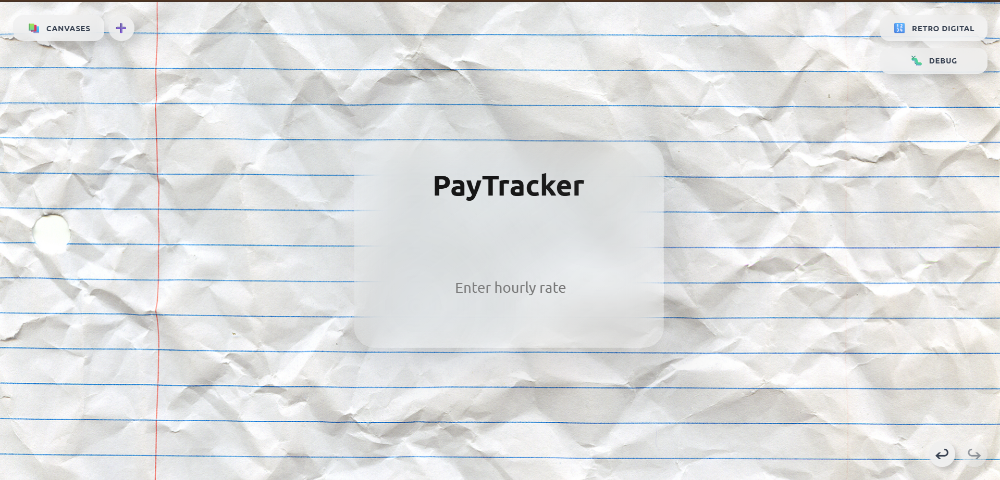
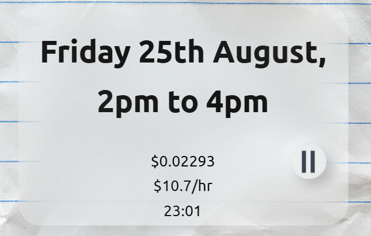
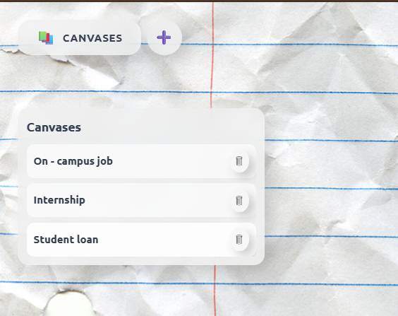
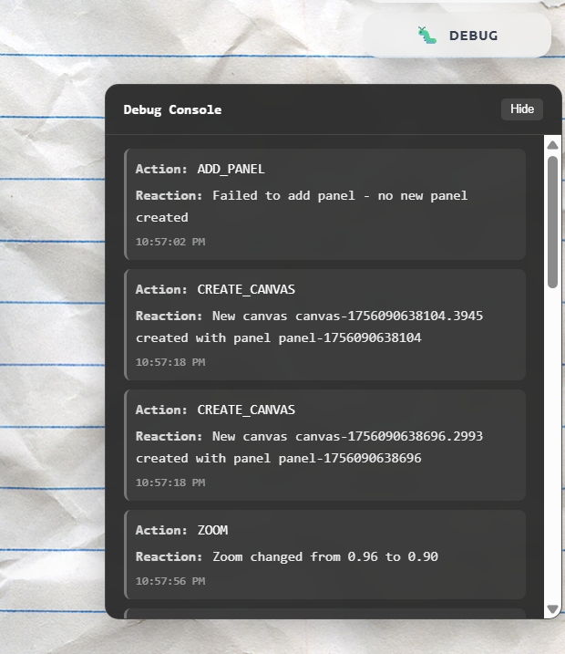
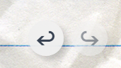

# Pay Check - Time Tracking & Earnings Calculator

A modern, elegant time-tracking application built with React and Vite. Track your work hours and calculate earnings in real-time with a beautiful, seamless interface featuring glassmorphism effects and intuitive controls.

## ✨ Features

- **Real-time Earnings Calculation**: Track earnings based on your hourly rate
- **Play/Pause Timer**: Start, pause, and resume tracking with intuitive controls
- **Editable Title**: Customize the app title by clicking on it
- **Parallax Effects**: Subtle mouse-following animations for enhanced UX
- **Responsive Design**: Clean, modern interface with glassmorphism effects
- **Background Texture**: Beautiful crumpled paper background
- **Undo/Redo Functionality**: Navigate through your tracking history
- **Debug Window**: Monitor application state and performance
- **Panel Management**: Dynamic panel positioning and edge detection

## 🖼️ Screenshots

### Homepage

*Clean, modern interface with glassmorphism effects*

### Main Panel

*Central control panel with earnings display and timer controls*

### Canvas System

*Multiple canvas layers for rich visual experience*

### Debug Window

*Real-time debugging and state monitoring*

### Undo/Redo Controls

*History navigation controls*

## 🚀 Getting Started

### Prerequisites
- Node.js (v16 or higher)
- npm or yarn

### Installation
1. Clone the repository:
   ```bash
   git clone https://github.com/Soham-Chousalkar/Pay_Check.git
   cd Pay_Check
   ```

2. Install dependencies:
   ```bash
   npm install
   ```

3. Start the development server:
   ```bash
   npm run dev
   ```

4. Open your browser and navigate to `http://localhost:3000`

## 🛠️ Available Scripts

- `npm run dev` - Start development server with hot reload
- `npm run build` - Build for production
- `npm run preview` - Preview production build locally
- `npm run serve` - Serve production build locally

## 🎨 Design Features

- **Glassmorphism**: Subtle transparency and blur effects
- **Neumorphic Elements**: Soft, extruded shadows and highlights
- **Custom Icons**: CSS-drawn play/pause icons for consistent styling
- **Smooth Animations**: Fluid transitions and hover effects
- **Parallax Background**: Dynamic mouse-following animations
- **Responsive Layout**: Adapts to different screen sizes

## 🏗️ Project Structure

```
src/
├── App.jsx                    # Main application component
├── main.jsx                   # Application entry point
├── index.css                  # Global styles and custom CSS classes
├── components/                # Reusable UI components
│   ├── DebugWindow.jsx       # Debug interface component
│   ├── EarningsPanel.jsx     # Earnings display component
│   ├── PanelWrapper.jsx      # Panel container component
│   └── RetroDigital.jsx      # Retro digital display component
├── hooks/                     # Custom React hooks
│   ├── useCanvas.js          # Canvas management hook
│   ├── useHistory.js         # History management hook
│   ├── usePanelEdgeDetection.js # Panel positioning hook
│   └── usePanelManagement.js # Panel state management hook
└── utils/                     # Utility functions
    ├── constants.js           # Application constants
    ├── dateUtils.js           # Date manipulation utilities
    └── panelUtils.js          # Panel utility functions
```

## 🔧 Technologies Used

- **React 19** - Modern React with hooks
- **Vite** - Fast build tool and dev server
- **Tailwind CSS** - Utility-first CSS framework
- **CSS3** - Custom animations and effects
- **PostCSS** - CSS processing and optimization

## 📱 Usage

1. **Set Hourly Rate**: Enter your hourly rate and press Enter
2. **Start Tracking**: Click the play button to begin tracking time
3. **Pause/Resume**: Use the play/pause button to control tracking
4. **View Earnings**: See real-time earnings calculation
5. **Customize Title**: Click on the title to edit it
6. **Navigate History**: Use undo/redo buttons to review past sessions
7. **Debug Mode**: Access debug information for development

## 🎯 Key Components

- **Main Panel**: Central container with glassmorphism effects
- **Control Button**: Circular play/pause button with custom icons
- **Earnings Display**: Real-time earnings with digital font
- **Rate Input**: Clean input field for hourly rate
- **Time Display**: Start time and duration information
- **Debug Window**: Real-time application state monitoring
- **History Controls**: Undo/redo functionality for session management

## 🌟 Recent Optimizations

- Clean, semantic class names
- Removed unused CSS and dependencies
- Improved code structure and readability
- Better state management and naming conventions
- Optimized build configuration
- Enhanced component architecture
- Improved performance with custom hooks

## 📄 License

This project is open source and available under the [MIT License](LICENSE).

## 🤝 Contributing

Contributions are welcome! Please feel free to submit a Pull Request.

1. Fork the repository
2. Create your feature branch (`git checkout -b feature/AmazingFeature`)
3. Commit your changes (`git commit -m 'Add some AmazingFeature'`)
4. Push to the branch (`git push origin feature/AmazingFeature`)
5. Open a Pull Request

## 📞 Support

If you have any questions or need help, please open an issue on GitHub.

---

Built with ❤️ using React and modern web technologies.

*Last updated: December 2024*
